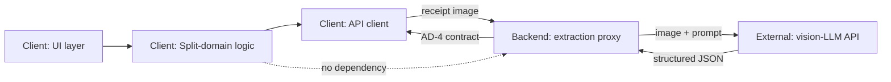
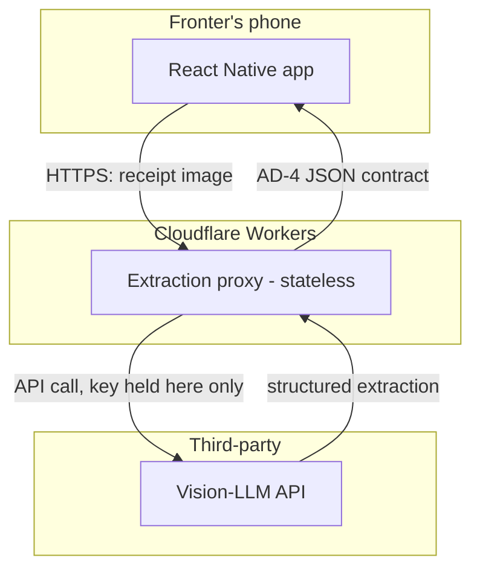

# Architecture Spine — hasebly

## Design Paradigm

Client-heavy layered app with a stateless edge proxy. All product logic — tax/service configuration, compounding calculation, item assignment, review/reconciliation, split display — lives in the mobile client as independent layers (UI → split-domain logic → API client). The backend is not a second application; it is a single-purpose translation edge: receipt image in, structured extraction JSON out, nothing retained. This keeps the correctness-critical calculation (FR-6, FR-8, FR-10) local, testable, and offline-capable once extraction returns, and keeps the backend swappable/disposable since it owns no state.

## Invariants & Rules

### AD-1 — Backend is a stateless extraction proxy only [ADOPTED]

- **Binds:** backend service; FR-2, FR-3.
- **Prevents:** the extraction-proxy route specifically from accumulating storage, user accounts, or split-calculation logic — kept stateless per its original FR-2/FR-3 scope. *(Amended 2026-07-29: this no longer prohibits server-side storage/accounts backend-wide — see AD-6, which formally supersedes that broader reading for the new groups/accounts surface added by Epic 2.)*
- **Rule:** The backend holds no database and no persistent state. It accepts one receipt image, calls the vision-LLM extraction API, and returns structured JSON or a defined error shape (see AD-4). It performs no split calculation, no storage, no per-user tracking.

### AD-2 — All split calculation is client-side domain logic [ADOPTED]

- **Binds:** client; FR-4 through FR-11.
- **Prevents:** tax/service compounding (FR-6), assignment math (FR-8), or reconciliation (FR-10) being duplicated or diverging between a client implementation and a server implementation.
- **Rule:** Tax/service confirmation, the FR-6 compounding formula, item assignment, per-person totals, and reconciliation against the Printed Total are computed entirely on-device from the extraction JSON. The backend never receives or returns split results.

### AD-3 — Money arithmetic uses integer minor units, never floating point

- **Binds:** all split-domain logic (FR-6, FR-8, FR-10); the extraction JSON contract (AD-4).
- **Prevents:** floating-point rounding drift causing per-person totals to silently fail to sum to the Printed Total — the exact failure SM-2 in the PRD exists to catch.
- **Rule:** All prices, subtotals, tax, service, and totals are represented as integers in minor currency units (piastres — EGP × 100) from the moment they leave the extraction boundary. Division for shared-item splits and percentage math rounds to the nearest minor unit using a single documented rounding rule (round-half-up), applied consistently everywhere money is divided.

### AD-4 — Extraction contract is provider-agnostic JSON, with an explicit failure case

- **Binds:** backend response shape; client parsing; FR-2, FR-3.
- **Prevents:** the client coupling to any single vision-LLM vendor's response format, and a failed/empty extraction being misread as a valid zero-item receipt.
- **Rule:** The backend always returns one of two shapes: `{status: "ok", items: [...], tax_line?, service_line?}` or `{status: "no_items_found"}` / `{status: "error", message}`. The client never receives a raw vendor payload. Swapping the underlying vision-LLM provider changes only the backend's internals, never this contract.

### AD-5 — No client-held secrets

- **Binds:** client build; backend.
- **Prevents:** the vision-LLM API key being extractable from an installed app binary (a real risk even at friends-only distribution scale).
- **Rule:** The vision-LLM API key lives only in the backend's environment configuration. The client authenticates to the backend with nothing more than a build-time app identifier if rate-limiting is needed later; it never holds a provider API key.

### AD-6 — Backend gains a persistent groups/accounts store, scoped apart from the extraction proxy [ADOPTED, supersedes AD-1's account/storage prohibition] `[Added 2026-07-29, Epic 2 — sprint-change-proposal]`

- **Binds:** backend service (`db/groups.ts`, `db/authSessions.ts`, `routes/auth.ts`, `routes/groups.ts`, `routes/settlements.ts`); FR-13 through FR-17.
- **Supersedes:** AD-1's original blanket "no server-side storage/accounts" prohibition, for the groups/accounts surface only.
- **Prevents:** the extraction proxy (AD-1's stateless surface) picking up incidental state as a side effect of the new groups backend — the two stay architecturally separate routes/modules within the same Worker, not entangled.
- **Rule:** Cloudflare D1 backs `groups`, `group_members`, `expenses`, `expense_items`, `expense_item_assignments`, `settlements`, and auth sessions. Auth is phone number + OTP (Twilio), issuing a bearer session token validated by `authMiddleware.ts`. The extraction proxy route remains stateless and unauthenticated per AD-1.

**Dependency direction:**



## Consistency Conventions

| Concern | Convention |
| --- | --- |
| Naming (entities, files, interfaces, events) | Domain terms match the PRD Glossary exactly (Fronter, Item, Assignment, Subtotal, Printed Total, Split) — no synonyms in code or types. |
| Data & formats (ids, dates, error shapes, envelopes) | Money: integer minor units (AD-3). Extraction response: AD-4's two-shape contract. Solo/local split: no client-side entity IDs needed — a single in-memory session, not a stored record. Group expenses (Epic 2): server-assigned IDs (`group.id`, `group_member.id`, `expense.id`) since these are stored/addressable records — see AD-6. |
| State & cross-cutting (mutation, errors, logging, config, auth) | Split-domain state is a single client-local session object, mutated only through the split-domain layer (never directly from UI event handlers) — this is what keeps FR-9's "editing recalculates all downstream totals" consequence guaranteed rather than incidental. Backend has no auth on the extraction-proxy route (AD-1 unchanged there). The groups/accounts surface (Epic 2, AD-6) uses phone+OTP auth issuing a bearer session token, validated by `authMiddleware.ts`. |

## Stack

| Name | Version |
| --- | --- |
| React Native (via Expo) | Expo SDK 57.0.7, React Native 0.86.0 (confirmed by actual `create-expo-app` install, 2026-07-19 — supersedes the SDK 56/RN 0.85 figure from initial authoring, which was ahead of actual release timing) |
| Backend runtime | Cloudflare Workers (free tier: 100K requests/day, well within 10-dinner-test volume; web-verified July 2026) |
| Client language | TypeScript |
| Client state (split-domain session) | React Context + hooks — no external state library needed at this scope |
| Vision-LLM extraction API | Provider left open behind AD-4's contract; any current vision-capable multimodal LLM API with structured/JSON output satisfies it (evaluate cost-per-scan at chosen volume before binding — see Deferred) |

## Structural Seed



**Deployment & environments:** Single environment for v1 — no dev/staging/prod split, since this is a pre-validation friends-only build (PRD §6.2: no public distribution). Client distributed via Expo EAS internal builds (TestFlight internal testing for iOS, direct APK or Play internal testing track for Android) — not published to public app stores. Backend deployed as a single Cloudflare Worker; the vision-LLM API key lives in the Worker's environment secret store (AD-5), never in the client bundle or repo.

```text
hasebly/
  client/                # scaffolded Story 1.1 (repo root kept separate from planning artifacts)
    app/                 # React Native (Expo) client
      screens/           # FR-1 capture, FR-4/5 tax-service, FR-7 assignment, FR-9 review, FR-11 split
      domain/            # split-domain logic: compounding calc (AD-2/AD-3), assignment, reconciliation - pure functions, unit-testable without the app shell
      api/               # API client calling the backend proxy (AD-4 contract)
    backend/
      worker/            # Cloudflare Worker: receives image, calls vision-LLM API, returns AD-4 contract
```

## Capability → Architecture Map

| Capability / Area | Lives in | Governed by |
| --- | --- | --- |
| FR-1 Capture receipt photo | `app/screens` | AD-5 (no key on client) |
| FR-2 Extract items and prices | `backend/worker` (call) + `app/api` (contract) | AD-1, AD-4 |
| FR-3 Handle unreadable/non-receipt photos | `backend/worker` (detects), `app/screens` (displays) | AD-4's `no_items_found` shape |
| FR-4/FR-5 Tax & service confirm/adjust | `app/domain` | AD-2 |
| FR-6 Compound tax on service-inclusive subtotal | `app/domain` | AD-2, AD-3 |
| FR-7/FR-8 Item assignment & fair share | `app/domain` | AD-2, AD-3 |
| FR-9 Review and edit before finalizing | `app/domain` (recalculation), `app/screens` (UI) | AD-2, Consistency Conventions (state mutation) |
| FR-10 Reconcile against printed total | `app/domain` | AD-3 |
| FR-11 Display final split | `app/screens` | — |
| FR-12 No in-app payment movement | (absence — no module exists for this) | AD-1 (backend has no payment surface either) |
| FR-13 Phone number + OTP authentication | `backend/worker` (`routes/auth.ts`, `db/authSessions.ts`) + `app/domain/account.tsx` | AD-6 |
| FR-14 Create and view groups | `backend/worker` (`routes/groups.ts`, `db/groups.ts`) + `app/screens` (CreateGroup, GroupList) | AD-6 |
| FR-15 Invite a member to a group by phone number | `backend/worker` (`routes/groups.ts`) + `app/screens` (InviteMember) | AD-6 |
| FR-16 Log a group expense | `backend/worker` (`routes/groups.ts`) + `app/screens/FinalSplitScreen` (branches on `session.group`) | AD-6, AD-2 (calculation itself stays client-side) |
| FR-17 Settle Up: net and pairwise balances | `app/domain/groupLedger.ts` + `app/screens/SettleUpScreen` | AD-6 |

## Deferred

- **Specific vision-LLM provider selection** (Anthropic, OpenAI, Google, or other) — AD-4's contract makes this swappable behind the proxy; pick based on cost-per-scan at actual 10-dinner-test volume, not decided here. PRD Open Question #2.
- **Rate-limiting / abuse protection on the proxy** — not needed for a handful of friends with a shared understanding of the test; revisit if the build is ever shared wider than that.
- **PRD §6.2 remainder** (local/synced split history, ads, live multiplayer assignment) — the account layer itself is now built (Epic 2, AD-6), as phone+OTP rather than the PRFAQ's anonymous-ID design. Local/synced history, ads, and live multiplayer assignment remain deferred; no architecture exists for those yet.
- **CI/CD and testing infrastructure** — out of scope for a solo 10-dinner validation build; revisit once past the go/no-go threshold.
